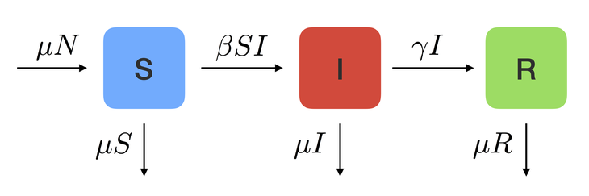

### Mathematical modelling of epidemics

The COVID-19 pandemic has stressed out the importance of having accurate, interpretable and robust models for the spread of an infectious disease in a population. In this work we build on well-established compartmental models for epidemic spread and include some of the features of the COVID-19 pandemic, like the existence of massive testing capabilities or the presence of wastewater detection plants. The result is a model which is partially tractable analytically and with interpretable parameters which can be used to design control policies to mitigate the spread of the disease. We also analyse its robustness with respect to model mismatches and external disturbances.

---

### Event-triggered discretizations of optimization flows

Recent interest in first-order optimization algorithms has lead to the formulation of so-called high-resolution differential equations, continuous surrogates for some of the classical discrete-time optimization algorithms exhibiting acceleration. The continuous setting allows the use of some powerful and well-established tools, like Lyapunov functions. This framework can be used to gain some intuition into the still somewhat mysterious phenomenon of acceleration. In this work we study these high-resolution differential equations and the crucial problem of re-discretizing them while maintaining their rate of convergence. We also review a recent paper that proposes a discretization technique by using ideas borrowed from event-triggered control and suggest some improvements on those algorithms in terms of their rate of convergence.

---

